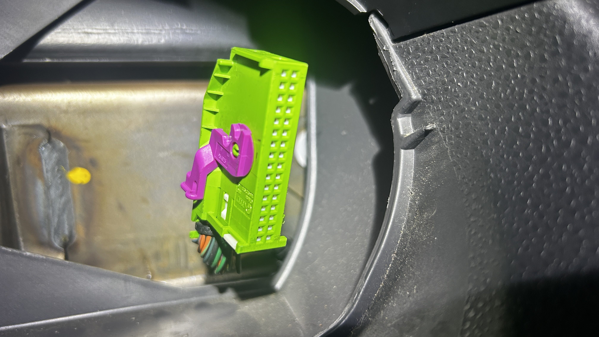

# Car Hacking: How to Hack Hazard Lights with Arduino and an MCP2515

### **Introduction**

In this post, I will explain how I used an Arduino Uno R3 and an MCP2515 CAN bus module to hack a 2012 Volkswagen Polo, inject messages onto its CAN bus, and control the hazard lights.

To fully understand this post, a basic understanding of what the CAN bus is and how it works is recommended. This video provides an excellent introduction to the fundamentals of the CAN serial communication protocol: [**Introduction to CAN Bus**](https://www.youtube.com/watch?v=JZSCzRT9TTo).

This article will not deeply explain the electrical principles or the low-level protocol of the CAN bus. Instead, it will focus on demonstrating how to access the CAN bus in a real vehicle and inject data onto it.

> **Disclaimer:** This project was performed on a 2012 VW Polo. The process will likely be different for other vehicles, although the core principles may be similar. Always proceed with caution.

---

### **Tools and Dependencies**

*   **Arduino Firmware:** The Arduino firmware relies on the [**arduino-mcp2515 library**](https://github.com/autowp/arduino-mcp2515) to communicate with the MCP2515 module.
*   **Host Scripts:** Since I use a MacBook, I could not use the standard `can-utils` suite, which is exclusive to Linux. To avoid using a VM, I created my own Python-based "copy" of some essential `can-utils` tools using the `python-can` library. All the scripts used in this guide can be found in my repository: [**can-utils-macos**](https://github.com/leandrobalta/can-utils-macos). But, if you can use **can-utils** library, the proccess will be basically the same.

---

### **Documentation**

To make our lives easier, some documents provide highly relevant information about the CAN buses in vehicles: the **Repair Manual** and the **Wiring Diagram**. These documents aren't perfect and won't explicitly tell you how to hack your car, but they contain valuable information about the electrical system and its modules.

For this project, I found the Wiring Diagram, which mentioned three critical pieces of information:
1.  Powertrain CAN (Engine) and Comfort CAN (windows, doors, lights...).
2.  The COMFORT CAN bus **bitrate is 500kbps**.
3.  The `a-can-h` (CAN High) and `a-can-l` (CAN Low) wires have the following colors: **orange/black** and **orange/brown**, respectively.


With this information, the next step is to find a physical location in the car that contains these wires. The documentation indicated that these wires are present in the instrument cluster (dashboard panel).

---

### **Finding the CAN Bus**

Following the documentation, I removed the instrument cluster to verify the presence of the specified wires.


<br>

<br>


After removing the panel, I identified two main connectors. I located the target CAN wires in the green connector.


<br>


The connector housing was sealed, making it impossible to see which external pin corresponded to which wire. To avoid damaging the connector, I used an oscilloscope (which would be necessary later anyway) and probed each pin until I found the signals for CAN High and CAN Low.


<br>


---

### **Setting Up the CAN Sniffer Environment**

After identifying the vehicle's CAN bus, it's time to configure our Arduino and MCP2515 to connect to it.

1.  **Prepare the Arduino:** Connect your Arduino Uno to your computer, open the Arduino IDE, and import the `arduino-mcp2515` library you downloaded from [this repository](https://github.com/autowp/arduino-mcp2515).
2.  **Upload the Firmware:** Open the `slcan` (Serial Line CAN) sketch available in my repository here: [`slcan.ino`](https://github.com/leandrobalta/can-utils-macos/blob/main/slcan/slcan.ino), and upload it to your Arduino.
3.  **Connect the Hardware:** Wire the Arduino to the MCP2515 module according to the schematic below.


Your hardware is now ready to read and write data on the car's CAN bus!

> **Pro-Tip:** To test if your Arduino-MCP2515 setup is reading data correctly, open the Serial Monitor in the Arduino IDE and set the baud rate to **115200**. If you see data being logged, congratulations! It's working.

---

### **Sniffing the CAN Bus**

From this point on, we will use the Python scripts from the [**can-utils-macos**](https://github.com/leandrobalta/can-utils-macos) repository to interact with the CAN bus.

First, set up your Python virtual environment:
```bash
python3 -m venv venv
source venv/bin/activate
pip install --upgrade pip
pip install -r requirements.txt
```

Next, let's use the **cansniffer_interactive.py** script to sniff CAN data.
```bash
# The device path /dev/cu.usbserial-A5069RR4 corresponds to my Arduino Uno.
# *Important:* This path will likely be different on your machine.
python cansniffer_interactive.py /dev/cu.usbserial-A5069RR4
```

With the sniffer running, the hard part begins: interacting with vehicle functions (pressing buttons, opening doors, etc.) and observing changes in the cansniffer output. After an intense search, I found something interesting related to **CAN ID 470**.

[](https://www.youtube.com/watch?v=bhGepUg1RVc)

To get a cleaner view of just this ID, I used the **candump.py** tool, filtering for that specific ID.

```bash
python candump.py /dev/cu.usbserial-A5069RR4 --backend slcan --bitrate 500000 -tc --filter 470:FFF
```

With the hazard lights OFF:


With the hazard lights ON:


This allowed me to identify the following patterns (focusing on the first byte):

- `80 00 00 FF 02`: Sent when the hazard lights are off.
- `8B 00 00 FF 02` and `88 00 00 FF 02`: Sent alternately when the hazard lights are on.

Now that we understand how the data works, we can inject our own.

---

### **Injecting Data**
To control the hazard lights, we will use the **cansend.py** script to send our own CAN messages.

Message to turn the hazard lights **ON**:
```bash
python cansend.py /dev/cu.usbserial-A5069RR4 470#8B0000FF02
```

And it worked!

Message to turn the hazard lights **OFF**:
```bash
python cansend.py /dev/cu.usbserial-A5069RR4 470#800000FF02
```

Here is a video demonstrating the injection in practice:

[](https://www.youtube.com/watch?v=GhfUjWhptTQ)

---

### **Conclusion**

Despite the challenges and the many hours spent exploring the vulnerabilities of my own car, it was incredibly rewarding to see this working on a real vehicle, not just in a lab or a CTF. I'm also pleased that I could complete this project with such a low-cost setup.

This project was heavily based on and inspired by the work of Faraday: [**How to unlock a door with a Doggie**](https://faradaysec.com/how-to-unlock-door-with-doggie/). Their content is amazing, so please check it out. I want to extend a special thanks to **Gaston** and **Octavio** from Faraday / Car Hacking Village, who helped me a great deal during these studies.

I hope this guide was helpful in some way. I will be presenting this research at conferences in Brazil, such as **H2HC** via the Car Hacking Village. Thank you for reading!

If you have any questions, feel free to reach out :)

[**Github**](https://github.com/leandrobalta?tab=repositories)
<br>
[**Email**](mailto:lbbraga@proton.me)

---

### **Created by**: Leandro Braga